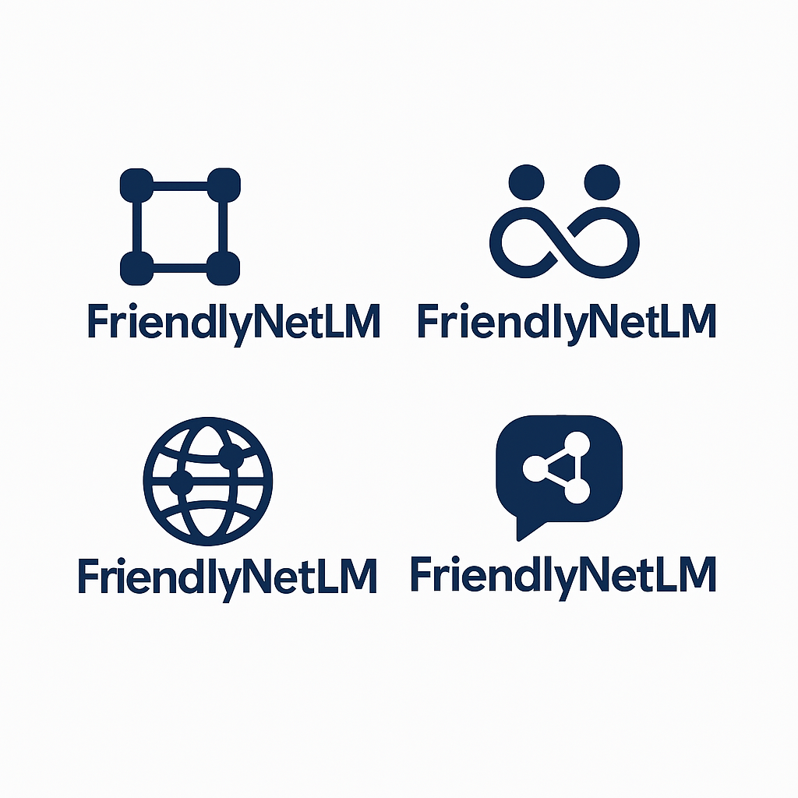

## COMM4190 (Spring 2005) Final Project

### Example Project 1 - *FriendlyNetLM* - A Social Network Co-pilot

### Overview

_FriendlyNetLM_ uses an LLM to help build, explore and display information about a users social network.

* Builds personal networks from narrative data, chat interaction and more structured name and link generation surveys.
* Generate network visualizations of complete or sub-networks
* Collect information and stories about 'friends' to expand and enrich network through chat
* Learn information from shared personal photos and photo feeds
* Process various communication logs (eg. email, SMS history) to extract additional 'friends' and evidence of interaction.
* Answer questions about user's social network and help plan social activities based on network data

----

